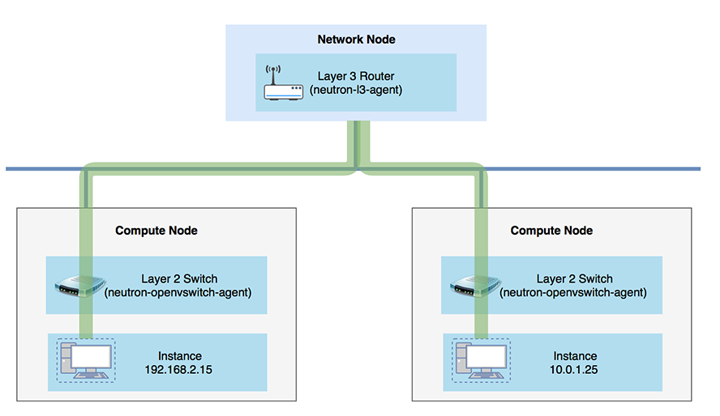
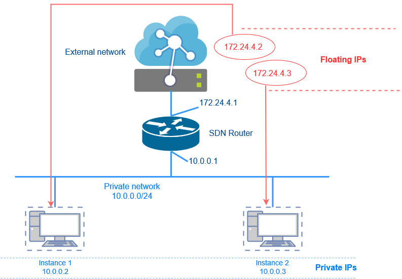
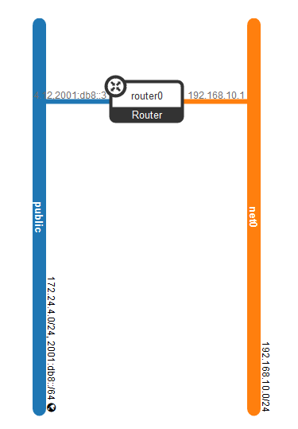
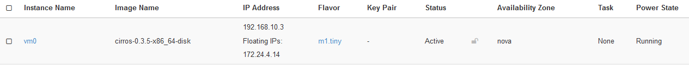
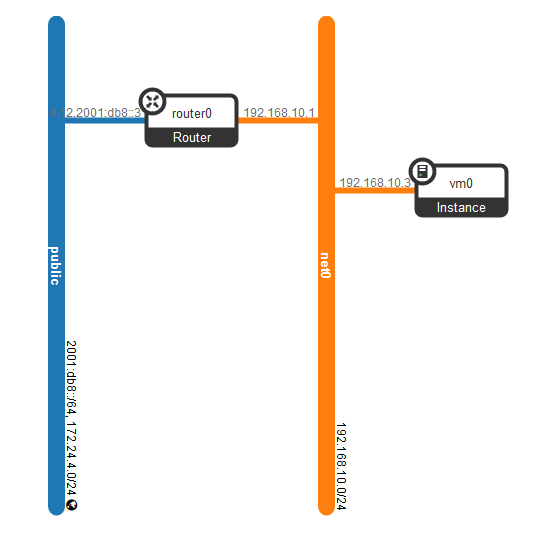
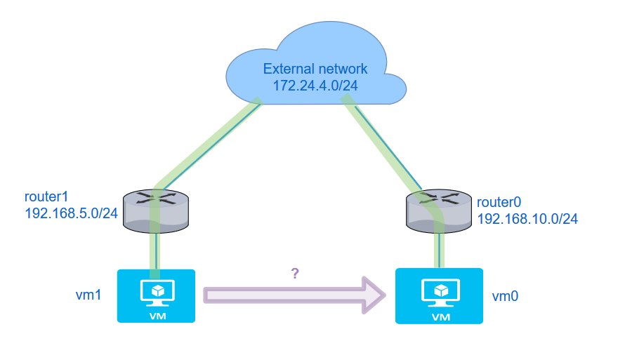
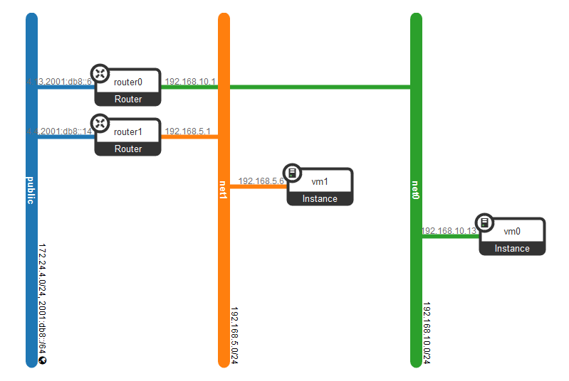
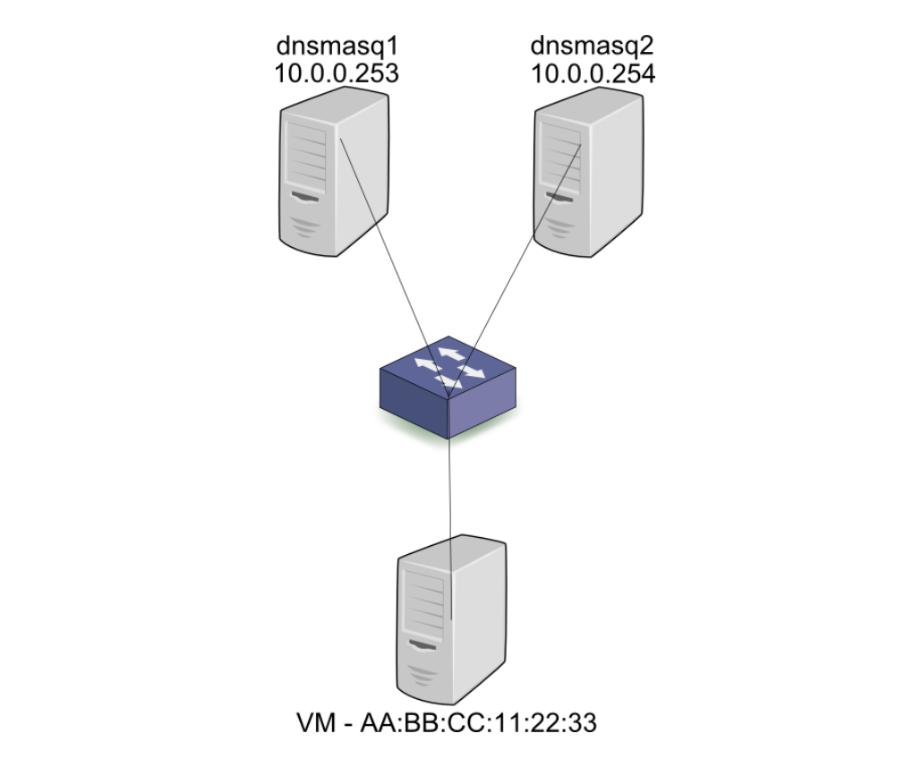

<!-- $theme: default -->
<!-- $size: 16:9 -->
<!-- footer: Fujitsu Vietnam -->
<!-- page_number: true -->

OpenStack Neutron: L3 Agent
===
<!-- *page_number: false -->

##### Nguyen Hai Truong

###### Software Engineer

###### truongnh@vn.fujitsu.com

---

# Contents

###### 1. What's L3 Agent?

###### 2. Tenant networks vs. Provider networks

###### 3. Floating IPs 

###### 4. Security group

###### 5. SNAT / DNAT

###### 6. L3 High Availability

###### 7. L2 Agent

###### 8. L2 OVS Agent & Linux bridge

###### 9. QoS
---

# What's L3 Agent?

###### Network traffic in between instances:
<center> 
  
   

</center>

---

# What's L3 Agent?

* Neutron-l3-agent: performs layer 3 routing between tenant private networks, the external network, and others
* Using Linux IP stack and **iptables** to perform L3 forwarding and NAT
* Using **network namespace** in the Linux kernel which supports overlapping IP address between tenants
* Creating routers that handle routing between directly-connected LAN interfaces (tenant networks, GRE or VLAN) and a single WAN interface (FLAT or VLAN provider network)

---

# Tenant vs. Provider networks


### *Tenant networks*

Tenant networks are created by **users** for connectivity with in projects

* **Flat:** All instances reside on the same network and can be shared with the hosts
* **VLAN:** Allows instances to communicate with each other across the environment
* **VXLAN & GRE tunnels:** Supports private communication between instances 


### *Provider networks*

Provider networks are created by the **OpenStack administrator** and map directly to an existing physical network

---
# Floating IPs


<center> 
  
   

</center>

---

# Floating IPs

* Used for communication with networks outside the cloud, including the Internet
* NOT automatically allocated to instances by default, they need to be attached to instances manually
* A floating IP address and a private IP address can be used at the same time on a NIC

---
# Demo

###### Create a network net0 with subnet subnet0
```sh
$ openstack network create --share net0  

$ openstack subnet create subnet0 --ip-version 4 --gateway 192.168.10.1 \ 
--network net0 --subnet-range 192.168.10.0/24
```
###### The network topology

<center> 
  
   

</center>

---

# Demo

###### Create a router to make a connection between public network and the private network net0 

```sh
$ openstack router create router0
```
###### Set gateway for router0 to tell OpenStack which network to use for Internet access

```html
$ openstack router set router0 --external-gateway public
```
###### Attach router0 to subnet0 of private net0

```sh
$ openstack router add subnet router0 subnet0
```
---
# Demo

The connection is already made, **192.168.10.1** is IP address of **internal interface** of router

<center> 
  
   

</center>

---
# Demo

###### Create a instance named vm0 and assign vm0 to the internal network net0

```
$ openstack server create vm0 --image cirros-0.3.5-x86_64-disk \

--flavor m1.tiny --network net0
```

###### Make vm0 accessible through a floating ip address

```
$ openstack floating ip create public

$ openstack server add floating ip vm0 172.24.4.14
```
  
###### Verify that the floating IP was assigned to vm0
<center> 
  
   

</center>

---
# Demo

Network topology:

<center> 
  
   

</center>

---
# Ping to Instance

###### Openstack uses network namespace to implement Software Defined Networking

```
$ ip netns show

qrouter-7d127054-7c2a-47f8-8f92-556eee667cad
qdhcp-c1829283-4ada-44de-8587-9c3ac1ab932c
```
**qrouter** namespace is what is representing the router that has just been created in SDN

Linux machine has IP adrress: **10.164.178.114**
:x: It's impossible to ping directly to vm0 which has IP: **192.168.10.3**
```
$ ping 192.168.10.3

PING 192.168.10.3 (192.168.10.3) 56(84) bytes of data.

```
---
# Ping to Instance

###### Running command 'ip a' in namespace in qrouter namespace

```sh
$ sudo ip netns exec qrouter-7d127054-7c2a-47f8-8f92-556eee667cad ip a
```
###### The external network interface 
```
22: qg-2d4b307d-a6: <BROADCAST,MULTICAST,UP,LOWER_UP> mtu 1500 qdisc noqueue 
    link/ether fa:16:3e:51:a6:46 brd ff:ff:ff:ff:ff:ff
    inet 172.24.4.12/24 brd 172.24.4.255 scope global qg-2d4b307d-a6
       valid_lft forever preferred_lft forever
    inet 172.24.4.14/32 brd 172.24.4.14 scope global qg-2d4b307d-a6
```
###### The router interface (the internal network interface)
```
23: qr-3594618d-10: <BROADCAST,MULTICAST,UP,LOWER_UP> mtu 1450 qdisc noqueue 
    link/ether fa:16:3e:c7:f1:8c brd ff:ff:ff:ff:ff:ff
    inet 192.168.10.1/24 brd 192.168.10.255 scope global qr-3594618d-10
```

---
# Ping to Instance


Now, the instance vm0 has been ready for ping, yet?!

```sh
$ ip netns exec qrouter-7d127054-7c2a-47f8-8f92-556eee667cad ping 192.168.10.3


PING 192.168.10.3 (192.168.10.3) 56(84) bytes of data.

```
##### :x: The instance vm0 still be not pingable due to firewall rules

---
# Security group

- Sets of IP filter rules that are applied to all project instances
- Define networking access to the instance
- All projects have a **default** security group: denies all incomming traffic and allows only outgoing traffic to instance

##### => In order to ping to instance vm0 in the previous demo, the default Security Group must be modified or create the new Security Group to allow incoming traffic

---
# Security group

###### Create a security group

```
$ openstack security group create mysc --description "Allow outcoming traffic"
```
###### Create a rule to allow ALL ICMP Ingress

```
$ openstack security group rule create mysc --ingress --protocol icmp \
--remote-ip 0.0.0.0/0
```
###### Add security group mysc to instance vm0
```
$ openstack server add security group vm0 mysc
```
---
# Ping to Instance

##### Now, the instance vm0 has been ready for ping

```sh
$ ip netns exec qrouter-7d127054-7c2a-47f8-8f92-556eee667cad ping 192.168.10.3


PING 192.168.10.3 (192.168.10.3) 56(84) bytes of data.
64 bytes from 192.168.10.3: icmp_seq=1 ttl=64 time=1.77 ms
64 bytes from 192.168.10.3: icmp_seq=2 ttl=64 time=0.603 ms
64 bytes from 192.168.10.3: icmp_seq=3 ttl=64 time=0.376 ms
^C
--- 192.168.10.3 ping statistics ---
3 packets transmitted, 3 received, 0% packet loss, time 2002ms
rtt min/avg/max/mdev = 0.376/0.918/1.776/0.614 ms

```


---
# SNAT / DNAT

<center>

  

</center>

---
# SNAT / DNAT

Setting up SDN following the topology in previous slide
```
$ openstack network create --share net1

$ openstack subnet create subnet1 --ip-version 4 --gateway 192.168.5.1 \
--network net1 --subnet-range 192.168.5.0/24

$ openstack router create router1

$ openstack router add subnet router1 subnet1

$ openstack router set router1 --external-gateway public

$ openstack server create vm1 --image cirros-0.3.5-x86_64-disk \
--flavor m1.tiny --network net1
```

---
# SNAT / DNAT
Network topology:

<center>

  

</center>

---
# SNAT / DNAT

Now, is there any connection between **vm0** and **vm1**?

Let try to ping from vm1 to vm0:

```
$ ping 192.168.10.13
PING 192.168.10.13 (192.168.10.13): 56 data bytes
^C
--- 192.168.10.13 ping statistics ---
10 packets transmitted, 0 packets received, 100% packet loss

```
:x: vm1 **is NOT** able to communicate with vm0

---
# SNAT / DNAT

```
$ openstack router set --route destination=192.168.10.0/24,\
gateway=172.24.4.13 router1
```
Ping from vm1 to vm0:
```
$ ping 192.168.10.13
PING 192.168.10.13 (192.168.10.13): 56 data bytes
64 bytes from 192.168.10.13: seq=0 ttl=62 time=2.950 ms
64 bytes from 192.168.10.13: seq=1 ttl=62 time=1.138 ms
64 bytes from 192.168.10.13: seq=2 ttl=62 time=0.729 ms
^C
--- 192.168.10.13 ping statistics ---
3 packets transmitted, 3 packets received, 0% packet loss
round-trip min/avg/max = 0.729/1.605/2.950 ms
```

---

# L3 High Availability
##### Without HA:
- Tenants create virtual routers, which are scheduled to run on physical L3 agent nodes

- When a L3 agent node is losed and the dependent virtual machines subsequently lose connectivity to external networks
##### => The floating IP addresses will also be unavailable, connectivity is also lost between any networks hosted by the router. 

---
# L3 High Availability

The DHCP protocol allows for the co-existence of multiple DHCP servers all serving the same pool, at the same time.

<center>

  

</center>

---
# L3 High Availability

#### When a virtual router fails :

* Virtual IP driver of the agent will send a notification to the controller.
* The controller could respawn the failed virtual router to another l3 agent as slave.
* HA routers operate across multiple neutron nodes (having a qrouter on each node)
* **VRRP** (Virtual Router Redundancy Protocol) and **keepalived** is used to pass control to another router in case of failure

---
# L2 Agent
- Serves layer 2 (Ethernet) network connectivity to OpenStack resources
- Runs on each Network Node and Compute Node
#### Modular Layer 2
- Neutron core plug-in
- Drivers for layer 2 network types and mechanisms - interface with agents, hardware, controllers...
- Works with existing L2 agents: 
	- Open vSwitch
	- Linux bridge


---
```
print("Thank you for your kind attention!");
```
---

